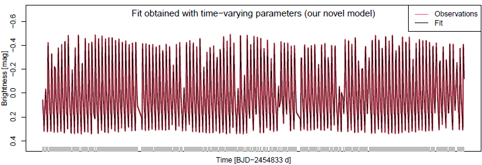

# Portfolio

## [Model for Periodic Variable Stars](https://github.com/DarlinSoto/Modulation-models)
This repository includes codes in R software to reproduce the figures in the paper [Motta, G., **D. Soto**, and M. Catelan (2022, January). Periodic variable stars modulated by time-varying parameters. ApJ 925(1), 73.](https://iopscience.iop.org/article/10.3847/1538-4357/ac3833)

## [Pronosticando el número de manchas solares](https://github.com/DarlinSoto/Sunspots)
Este repositorio incluye el ajuste de un modelo ARMA para pronosticar el núméro de manchas solares. 

---

© 2020 Khanh Tran. Powered by Jekyll and the Minimal Theme.

